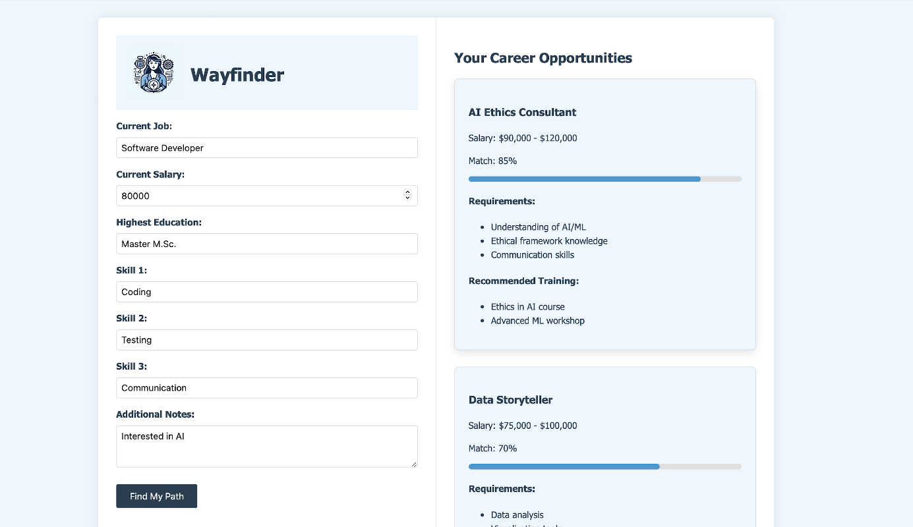

# Wayfinder

Wayfinder is a single-page web application designed to suggest alternative careers to users, especially during times of significant job transitions due to artificial intelligence (AI). The suggested careers take into account the user's current career, education, personal skills, and previous income level.



## Live Testing

You can test Wayfinder live by following this [link](https://github.com/denniskotte/wayfinder/edit/main/README.md).

## Features

- **Career Suggestions:** Based on the input information, the app provides alternative career suggestions.
- **Requirements Checklist:** For each suggested career, a list of requirements is displayed for the user to check off.
- **Job Portal Links:** If no significant knowledge gaps are present, links to job portals are shown.
- **Training and Schedule:** For remaining requirements, a list of trainings and a schedule is provided to help the user acquire the necessary knowledge. Links to training courses are also included.

## Usage

1. Enter your current job, skills, and notes into the respective fields.
2. Click the submit button to send the information.
3. View the formatted results in the Wayfinder app.

## Technologies

- **Frontend:** HTML, CSS, JavaScript
- **Backend:** API for processing inputs and generating suggestions

## Installation

1. Clone the repository:
   ```bash
   git clone https://github.com/denniskotte/wayfinder.git
   ```
2. Navigate to the project directory:
   ```bash
   cd wayfinder
   ```
3. Open `index.html` in your preferred web browser.